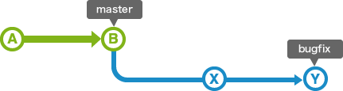

# Git入門2 ヴァージョン管理

* * *

#### ここからは、ブランチといったパラレルに存在するヴァージョン管理について、整理していきます。

<br>

## Index:

1. ブランチ
2. 複数存在するブランチの運用
3. チェックアウト
4. ヘッド
5. スタッシュ
6. 2種類のマージ方法
7. リベース
8. 具体例
9. プルリクエスト

<br>

## 1\. ブランチ

* * *

<br>

Branchが意味する通り、履歴の流れを分岐して記録していくことを意味します。

> ソフトウェアの開発では、ひとつのソフトウェアに対して複数のメンバーが同時に機能追加を行ったり、バグ修正を行ったりといったことがあります。また、複数のリリースバージョンが存在する状態で、それぞれを保守しなければならないといったこともあります。
> 
> 
> 
> このような、並行して行われる複数の機能追加やバージョン管理を支援するため、Gitには==ブランチ==という機能が備わっています。

<br>

> 分岐したブランチは他のブランチと合流(マージ)することで、一つのブランチにまとめ直すことが出来ます。
> 
> <br>
> 
> 1. メインのブランチから自分の作業専用のブランチを作成 
> 2. 作業の終わったメンバーは、メインのブランチに自分のブランチの変更を取り込む
> 
> <br>
> 
> このようにすることで、他のメンバーの作業による影響を受けることなく、自分の作業に取り込むことができます。また、**作業単位で履歴を残すことで、問題が発生した場合に原因となる変更箇所の調査や対策を行うことが容易になります**。
> 
> 

<br>

### 指針

- 作業単位で、ブランチを作る
- そして、変更点単位で履歴（コメントを残す）
- それをまた何か別のファイルで履歴として構造化する

### メリット

- エラー発生時に、発生源を辿りやすい
- 今後の拡張に合わせて、システムを整えやすい
- 担当者が変わっても、対応を検討し易い

<br>

## 2. ブランチの運用

* * *

<br>

複数存在するブランチの中でも、リリース版が何時でも作成可能なようしておくためのブランチを==masterブランチ==と呼びます。

これに対し、先のリリースに向けた普段の開発に使うブランチを==developブランチ==と呼びます。これは、==統合ブランチ==の役割を担います。統合ブランチは、デベロップブランチの主軸となるブランチで、派生する==トピックブランチ==をマージするものです。

<br>

> トピックブランチとは、機能追加やバグ修正といったある課題に関する作業を行うために作成するブランチです。複数の課題に関する作業を同時に行う時は、その数だけトピックブランチが作成されます。
> 
> トピックブランチは安定した統合ブランチから分岐する形で作成し、作業が完了したら統合ブランチに取り込むという使い方をします。
> 
> 

つまり、作成途中はデベロップ、完成したのはマスター。マスターはトピック分だけあって、統合は1つ。そして、この連なりで1つのバージョンと考えることができます。

<br>

## 3\. チェックアウト

* * *

<br>

作業するブランチを切り替えるには、==チェックアウト==という操作を行います。

> チェックアウトを行うと、まず移動先のブランチ内の最後のコミットの内容がワークツリーに展開されます。また、チェックアウト後に行ったコミットは、移動後のブランチに対して追加されるようになります。  
> <br>
> ex.) main→feature-loginとブランチを切り替えた場合  
> 
> 1. feature-oginの最後のコミット（=ローカルレポジトリ内の最新データ）が、ワークツリーに展開される。
> 2. その後新しく移動してきた feature-login に、変更情報が加えられる

<br>

## 4\. ヘッド

* * *

<br>

ヘッドとは、、==「いま自分がいる場所を指さしている『人さし指』」==のことを意味します。

<br>

> このとき、「あなたが今、どのセーブデータの上に立って作業しているか」を示すピン（カーソル）が必要です。それが **HEAD** です。
> 
> - `git checkout main` と打つと、HEAD（指）が `main` ブランチの最新のセーブデータを指します。
> - `git checkout feature` と打つと、HEAD（指）が `feature` ブランチの最新のセーブデータへ移動します。

<br>

つまり、ブランチとは、コミット（セーブデータ）が点々と繋がってできている、歴史本＝タイムラインのこと。ヘッドとは、その本のページを指す指。

<br>

指の挿す位置を変えて、ここのデータを見ます！と言うふうに指示することで、ヴァージョンを自在に切り替えられる。

<br>

> #### ~（チルダ）
> 
> - **`HEAD`**：現在のセーブデータ（最新）
> - **`HEAD~`**（または `HEAD~1`）：1つ前のセーブデータ（お父さん）
> - **`HEAD~~`**（または `HEAD~2`）：2つ前のセーブデータ（おじいちゃん）
> - **`HEAD~3`**：3つ前のセーブデータ（ひいおじいちゃん）
> 
> #### ^（キャレット）
> 
> - **`HEAD^1`**：1番目の親（基本的には、自分が元々いたブランチ側）
> - **`HEAD^2`**：2番目の親（合流してきた、相手のブランチ側）
> 
> <br>
> 
> ~(チルダ)と^(キャレット)を使ってあるコミットからの相対位置で指定する
> 
> 

<br>

<br>

## 5\. Stash

* * *

<br>
一言でいうと、==Stash==とは「作業中のコードを、一時的に入れておける秘密の引き出し」。

英語では、隠し場所に安全にしまう、隠すの意。

<br>

### Stashの使用例

### 救急処理

あなたが「ログイン機能」の開発中で、ファイルを何個か書き換えているとします。まだコードはボロボロで、コミット（セーブ）できる状態ではありません。

そんな時、突然先輩から「ごめん！大至急、本番環境のバグを直して！」と頼まれてしまいました。

バグを直すには `main` ブランチに移動（チェックアウト）する必要がありますが、Gitは「作業中のボロボロなファイルがある状態でのブランチ移動」を嫌がって、エラーを出して止めてしまいます。

> 🤔 **心の声:**
> 
> 「えー！でも、まだ未完成だからコミット（セーブ）したくないし…、かといって今まで書いたコードを消すなんて絶対ムリ！」

ここで救世主となるのが **`git stash`** です。

<br>

### スタッシュの仕組みと流れ


（Git stashのデータ移動イメージ. ソース: JavaScript in Plain English）

<br>

図を見るとイメージが湧きやすいです。私たちが作業している場所（Working Directory）から、通常のルート（Git Repositoryへのコミット）ではなく、**「Stash」という別の引き出し**にデータを一時退避させています。

<br>

操作の手順はとてもシンプルで、たったの3ステップです。

#### ① 引き出しに隠す（退避）

Bash

```
git stash

```

このコマンドを打つと、今あなたが書き換えていたコードが、**一瞬で「秘密の引き出し（Stash）」の中に格納され、作業画面は綺麗な状態（最後のコミット直後）にリセット**されます。

これで、安全に他のブランチへ移動してバグ修正ができるようになります！

#### ② 急ぎの仕事を終わらせる

ブランチを切り替えてバグを直し、コミットしてリモートにプッシュします。

#### ③ 引き出しから出して再開（復元）

元のブランチに戻ってきたら、引き出しから荷物を取り出します。

Bash

```
git stash pop

```

これを打つと、**引き出しに隠してあった「書きかけのコード」が手元にフワッと戻ってきます。** あとは何事もなかったかのように開発を再開するだけです。

<br>

## 6\. マージ

* * *

<br>
マージには、`fast-forward` と`non fast-foreward` とがある。

<br>

### 前提

例えば、以下のようなmaster（統合）ブランチから派生した、トピックブランチがあるとする。



<br>

### fast-forward

* * *

<br>


<br>

このように、masterブランチから一直線に変更の修正が行われている場合、bugfixのブランチはmasterブランチの履歴を全て含んでいるため、masterブランチが、単純に移動するだけで、変更内容を全て取り込むことができる。このようなマージを==fast-forward==(早送り)マージと呼びます 。

<br>

### non fast-foreward

* * *

<br>

masterブランチの履歴がbugfixブランチを分岐した時より進んでしまっている場合もあります。この場合は両方のmasterブランチでの変更内容とbugfixブランチでの変更内容を一つにまとめる必要があります。


そのため、両方の変更を取り込んだマージコミットが作成されます。masterブランチの先頭はそのコミットに移動します。


<br>

#### それぞれのメリット・デメリット

* * *

<br>
マージの実行時に、non fast-forwardマージというオプションを指定することで、fast-forwardマージが可能な場合でも新しくマージコミットを作成して合流させることもできます。


non fast-forward

- ブランチがそのまま残るので、そのブランチで行った作業の特定が容易
    - 機能ごとの区切りが明確
    - 機能単位での取り消しが狩野
- 誰がいつ、どんな変更を加えたかと言う記録が逐一残る

<br>

fast-forward

    - 枝分かれが発生しないため、後から見たときに、どの順番で何が起きたかが1本道で非常に見やすい
    - 余計な履歴が増えない

<br>

## 7\. Rebase

* * *

<br>
状態的には、`non fast-forward` を使う時と同じですが、mergeの仕方が異なります。まずは以下の例をもとに説明します。

<br>


==rebase==とは、このように、bugfixブランチの履歴がmasterブランチの後ろに付け替えること（2枚目）を意味します。つまり、masterブランチの後ろに、トピックブランチを付け加えることです。

<br>

※注意点

- rebaseしただけだとmasterの先頭の位置はそのまま。そのため、masterブランチからbugfixブランチをマージして、bugfixの先頭まで移動する（3枚目）
- この場合、コミットXとYでは競合が発生する場合がある。  
その時はそれぞれのコミットで発生した競合箇所を修正していく必要がある。  

<br>

### Rebaseとnon fast-forwardの違い

* * *

例え話：2人で1冊の「共有ノート」に記録をつけていると想像してみる。

<br>

#### **Non-Fast-Forward** 

> あなたが別のルーズリーフ（ブランチ）にアイデアを書いて、あとから共有ノートに「ルーズリーフをセロハンテープでペタッと貼り付けた」状態です。 「別紙で作業して、後から貼ったんだな」という**事実がそのまま残ります。**  
> これは、**`merge`** である。

<br>

#### **Rebase**

> あなたがルーズリーフに書いた内容を、共有ノートの最新の白紙ページの続きに、あたかも最初からそこに清書していたかのように綺麗に書き写した状態です。 あとから見た人は、別紙で作業していたことすら気づかず、**1本の綺麗な日記のように読めます。**
> 
> これは、`rebase` である。

<br>

<br>

### 実務での使い分け

* * *

<br>

現場によってルールは異なりますが、最も一般的な使い分けはこれです。

<br>

1. Rebase
    - トピックブランチに統合ブランチの最新のコードを取り込む場合
2. Non-Fast-Forward
    - 完成した機能を main に合流させるとき

<br>

つまり、==変更内容が増えすぎると、履歴が煩雑になるので、それに応じて使い分けると言うのが基本指針==です。

必要のない履歴は、つけない。例えば、ローカルのコードのマージ・同期処理は`fast-forward`や`rebase` で更新する。

一方で、機能ごとにまとまりを分けて置いたら、後々楽だよなと言うことで、機能別に`non　fast-forward`で、歴史の修正点を記録するといった使い分けを行いましょう。

<br>

### Rebaseで絶対にやってはいけないこと

* * *

<br>

「すでにリモートリポジトリにプッシュして、他の人も使っているコミット」に対して、Rebaseを行うこと。

<br>

Rebaseは「歴史の書き換え」です。そのため、上記のことを行うと、 他の人のGitの歴史と辻褄が合わなくなり、大混乱（リポジトリの破壊）を引き起こす原因になります。Rebaseはあくまで「自分のローカルPC内だけの秘密の歴史整理」に使うもの、と覚えておいてください！

<br>

## 8\. 具体例

* * *

<br>

<br>

### 運用のイメージ1（簡単）

トピックブランチと統合ブランチを使用した運用方法について、簡単な例を使って説明します。

例えば、機能の追加を行うトピックブランチで作業を行なっている途中に、バグの修正を行わなければならなくなったとします。


このような場合でも、統合ブランチは機能追加をはじめる前の状態なので、ここから新たにバグ修正用のトピックブランチをつくることで、機能追加とは独立して作業を始めることが出来ます。


完成したバグ修正の内容は、元の統合ブランチに取り込むことで公開出来ます。


元のブランチに戻って機能追加の作業の続きを行うことが出来ます。


しかし、作業の続きを行うには今のバグ修正、コミットXの内容が必要だったことに気づきました。ここで、コミットXの内容を取り込むには直接mergeする方法と、==コミットXを取り込んだ統合ブランチにrebaseする==方法があります。

ここでは、統合ブランチにrebaseすることにしました。


これで、コミットXの内容を取り込んだ状態で機能追加の続きをすすめることができます。

### 運用のイメージ2（ややむずかしい）

A successful Git branching model

* * *

<br>
Gitでのブランチの運用モデルを紹介します。

日本語訳: [http://keijinsonyaban.blogspot.jp/2010/10/successful-git-branching-model.html](http://keijinsonyaban.blogspot.jp/2010/10/successful-git-branching-model.html)

原文: [http://nvie.com/posts/a-successful-git-branching-model/](http://nvie.com/posts/a-successful-git-branching-model/)

<br>

この運用モデルでは、大きく分けて以下の4種類のブランチを使い分けながら開発を進めていきます。

- **メインブランチ**
- **フィーチャーブランチ(トピックブランチ)**
- **リリースブランチ**
- **ホットフィックスブランチ**

**<br>
**


#### <br>

#### メインブランチ

* * *

<br>
masterブランチとdevelopブランチの2つをメインブランチとして使用します。

- **master**masterブランチでは、リリース可能な状態だけを管理します。また、==コミットにはタグを使用してリリース番号==を記録します。
- **develop(トピックブランチ)**developブランチでは、先のリリースに向けた普段の開発で使用するブランチです。先に説明した統合ブランチの役割を担います。

<br>

#### フィーチャーブランチ

* * *

<br>
フィーチャーブランチでは、先に説明したトピックブランチの役割を担います。

このブランチは新機能の開発や、バグ修正を行う際にdevelopブランチから分岐します。==フィーチャーブランチでの作業は基本的に共有する必要がないので、リモートでは管理しません。==開発が完了したら、developブランチにマージを行うことで公開します。

<br>

#### リリースブランチ

* * *

<br>
リリースブランチでは、リリースの準備を行います。なお==慣例として、ブランチ名の頭には release- をつけます。==リリースブランチを作ることで、最終的な調整はこのブランチで行いながら、更に次のリリースに向けた開発をdevelopブランチ上ですすめることができます。

普段の開発はdevelopブランチ上で行なっているため、ほとんどリリース可能な状態が近づいてからリリースブランチを作成します。そして、リリースに向けた最終的なバグ修正などの開発を行います。

最終的に、リリースブランチがリリース可能な状態になったらmasterブランチにマージを行い、できたマージコミットに対して==リリース番号のタグを追加します。==

また、リリースブランチ上で行った修正を取り込むため、developブランチに対してもマージを行います。

<br>

#### ホットフィックスブランチ

* * *

<br>
リリースした製品に緊急で修正が必要になった場合に、masterブランチから分岐して作成されるブランチです。== 慣例として、ブランチ名の頭には hotfix- をつけます。==

例えば、developブランチ上での開発がまだ中途半端な状態の時に、緊急で修正が必要になったとします。この場合、developブランチからリリース可能なバージョンを作るのは時間がかかるため、masterブランチから直接ブランチを作成して修正を行い、マージします。  
（※この時、developブランチは`stash`します。）

修正時に作成したホットフィックスブランチは、developブランチにもマージして取り込みます。

<br>

<br>

## 9\. プルリクエスト

* * *

<br>
プルリクエストとは、開発者のローカルレポジトリの変更内容を、他の共同開発者に通知（し、レビューを依頼）する機能。

プルリクエストを行うと、マージ前に他の開発担当者が変更箇所をチェックできるので、バグやエラーが起こりづらい。

<br>


- プルリクエスト作成者とレビュー担当者は、プルリクエスト上でコメントをやりとりして議論できます。
- 必要があれば、対象のブランチに何度でも変更をコミット・プッシュできます。プッシュされたコミットは、自動的にプルリクエスト上に反映されます。
- 上記のようなやりとりを経て、最終的にマージされるソースコードの品質を高くできます。
- これらのやりとりはサーバ上に記録されているため、問題が起こった時に過去のやりとりを見て再度議論できます。


